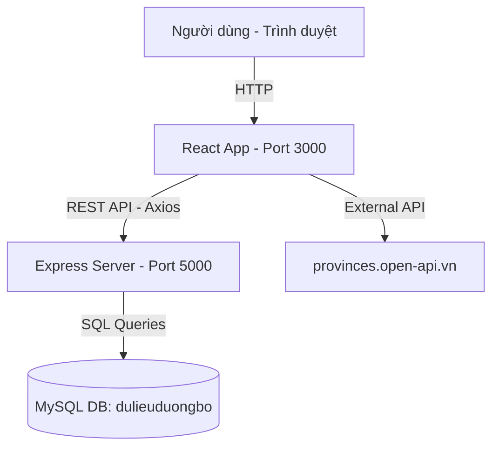
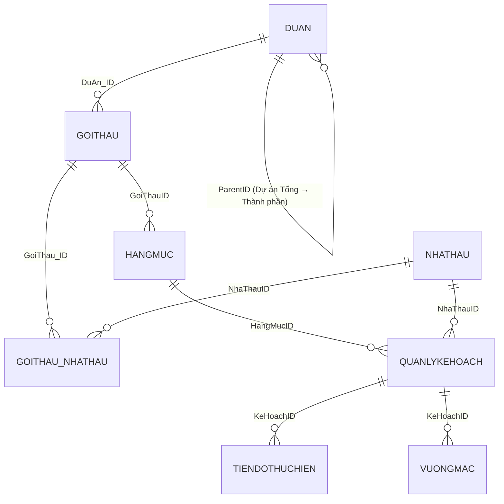
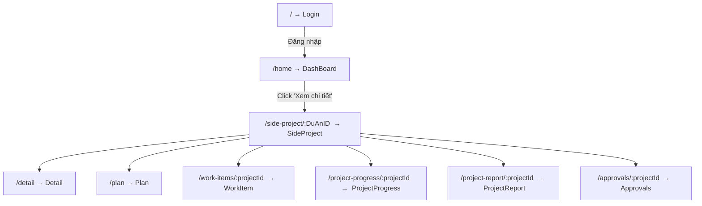
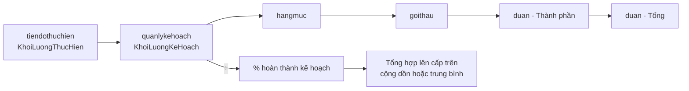

# Phân tích Luồng Chức năng – WebsiteDuongBo

> **Tên hệ thống:** Hệ thống quản lý, giám sát, dự báo, cảnh báo tiến độ và chất lượng các dự án đường bộ
> **Đơn vị:** Bộ Xây Dựng – Cục Kinh tế Quản lý Đầu tư Xây dựng

---

## 1. Kiến trúc tổng quan



| Tầng | Công nghệ | Vị trí |
|------|-----------|--------|
| **Frontend** | React 19, React Router v7, TailwindCSS, Chart.js, Leaflet | `src/` |
| **Backend** | Node.js, Express, mysql2 | [back-end/server.js](file:///d:/40.Web%20qu%E1%BA%A3n%20l%C3%BD%20d%E1%BB%AF%20li%E1%BB%87u%20%C4%91%C6%B0%E1%BB%9Dng%20b%E1%BB%99/Code/WebsiteDuongBo/back-end/server.js) |
| **CSDL** | MySQL (localhost:3306) | DB: `dulieuduongbo` |

---

## 2. Mô hình dữ liệu (Database Schema)

Hệ thống sử dụng cấu trúc **phân cấp 5 tầng**:



| Bảng | Mô tả |
|------|-------|
| `duan` | Dự án (cả Tổng và Thành phần, phân biệt bằng `ParentID IS NULL`) |
| `goithau` | Gói thầu xây lắp, có tọa độ Km đầu/cuối |
| `nhathau` | Nhà thầu thi công |
| `goithau_nhathau` | Bảng nối: vai trò nhà thầu trong gói thầu |
| `hangmuc` | Hạng mục công việc (giao thông, GPMB, hạ tầng…) |
| `quanlykehoach` | Kế hoạch thi công (khối lượng kế hoạch, ngày) |
| `tiendothuchien` | Cập nhật khối lượng thực hiện theo thời gian |
| `vuongmac` | Vướng mắc phát sinh (GPMB, kỹ thuật…) |

---

## 3. Luồng điều hướng Frontend (React Router)



Tất cả các trang (trừ Login) đều được bọc trong [LayoutWithSidebar](file:///d:/40.Web%20qu%E1%BA%A3n%20l%C3%BD%20d%E1%BB%AF%20li%E1%BB%87u%20%C4%91%C6%B0%E1%BB%9Dng%20b%E1%BB%99/Code/WebsiteDuongBo/src/App.js#16-28) gồm:
- **Sidebar** (thanh điều hướng trái)
- **ChatbotButton** (nút trợ lý AI góc phải)

---

## 4. Luồng chức năng từng trang

### 4.1  Đăng nhập (`/`)
- Hiển thị form đăng nhập với logo Bộ Xây Dựng
- **Hiện tại chưa xác thực thật** – bấm "Đăng nhập" chuyển thẳng sang `/home`
- Có nút "Thoát" (chưa có hành động)

---

### 4.2  Dashboard – Danh sách dự án (`/home`)

**Luồng:**
```
Tải trang → Gọi 3 API song song:
  ① GET /duAnTongList   → ds dự án tổng (có tính % hoàn thành)
  ② GET /nhaThauList    → ds nhà thầu
  ③ GET provinces API   → ds tỉnh/thành
→ Hiển thị bảng danh sách dự án
→ Người dùng lọc theo: tên, ngày, tỉnh, trạng thái, nhà thầu, % hoàn thành
→ Chuyển sang xem bản đồ (Leaflet) hoặc xem bảng
→ Click "Xem chi tiết" → navigate('/side-project/:DuAnID')
```

**Dữ liệu hiển thị trên bảng:**
| Cột | Nguồn |
|-----|-------|
| Tên dự án | `TenDuAn` |
| Dải tuyến | `TongChieuDai` km |
| DA Thành phần | `soLuongDuAnThanhPhan` |
| Gói thầu | `soLuongGoiThau` |
| Trạng thái | `TrangThai` (badge màu) |
| Tiến độ | `hangMuc.tienDo.phanTramHoanThanh` từng hạng mục |

---

### 4.3  Chi tiết dự án tổng (`/side-project/:DuAnID`)

- Hiển thị thông tin tổng hợp của **Dự án Tổng** (CĐT, nguồn vốn, ngày KCông, chiều dài…)
- Danh sách **Dự án Thành phần** với % hoàn thành, % kế hoạch, % chậm tiến độ
- Bản đồ Leaflet hiển thị vị trí từng đoạn tuyến
- Menu điều hướng sang các module con:
  - **Hạng mục** (WorkItem)
  - **Tiến độ** (ProjectProgress)
  - **Báo cáo** (ProjectReport)
  - **Phê duyệt** (Approvals)
  - **Kế hoạch** (Plan)

---

### 4.4  Hạng mục thi công (`/work-items/:projectId`)

- Gọi `GET /hangMuc/:duAnThanhPhanId/detail`
- Hiển thị cây: **Gói thầu → Hạng mục → Danh sách kế hoạch**
- Mỗi kế hoạch có: tên công tác, KL kế hoạch, KL thực hiện, % hoàn thành, ngày bắt đầu/kết thúc

---

### 4.5  Tiến độ thi công (`/project-progress/:projectId`)

- Gọi `GET /duAn/:duAnId/detail`
- Hiển thị tiến độ thực hiện tổng thể theo từng dự án thành phần → gói thầu → hạng mục
- Tính toán:
  - `phanTramHoanThanh = (KL thực hiện / KL kế hoạch) × 100`
  - Đánh giá rủi ro: quá hạn × 2 + sắp đến hạn → "Rủi ro cao / Có rủi ro / Ổn định"

---

### 4.6  Vướng mắc (`/approvals/:projectId`)

- Gọi `GET /duAn/:duAnId/vuongMac`
- Liệt kê vướng mắc theo: Loại vướng mắc, Mô tả, Ngày phát sinh, Mức độ, Biện pháp xử lý
- Phân loại: "Đã phê duyệt" (có biện pháp xử lý) / "Chưa phê duyệt"

---

### 4.7  Báo cáo (`/project-report/:projectId`)

- Tổng hợp số liệu để xuất báo cáo (ExcelJS / file-saver)
- Giao diện dạng bảng tổng hợp

---

### 4.8  Kế hoạch (`/plan`)

- Quản lý kế hoạch tổng thể dự án
- Hỗ trợ Spreadsheet (Syncfusion / react-spreadsheet)

---

## 5. Danh sách API Backend ([server.js](file:///d:/40.Web%20qu%E1%BA%A3n%20l%C3%BD%20d%E1%BB%AF%20li%E1%BB%87u%20%C4%91%C6%B0%E1%BB%9Dng%20b%E1%BB%99/Code/WebsiteDuongBo/back-end/server.js) – Port 5000)

| Method | Endpoint | Chức năng |
|--------|----------|-----------|
| GET | `/duAnTongList` | Lấy tất cả dự án tổng + tổng hợp tiến độ |
| GET | `/duAn/:duAnId` | Chi tiết dự án tổng + các DA thành phần |
| GET | `/duAnThanhPhan/:duAnId` | Thông tin DA thành phần theo DA tổng |
| GET | `/duAnThanhPhan/:duAnId/detail` | Chi tiết đầy đủ tất cả các cấp |
| GET | `/duAn/:duAnId/detail` | Chi tiết DA tổng phân theo loại hạng mục |
| GET | `/duAn/:duAnId/vuongMac` | Danh sách vướng mắc toàn DA tổng |
| GET | `/duAn/goiThau/:duAnId` | Danh sách gói thầu của DA |
| GET | `/goiThau/chiTiet/:goiThauId` | Chi tiết gói thầu + tiến độ + rủi ro |
| GET | `/hangMuc/:duAnThanhPhanId/detail` | Hạng mục + kế hoạch + KL thực hiện |
| GET | `/hangMuc/:duAnThanhPhanId/vuongMac` | Vướng mắc theo DA thành phần |
| GET | `/nhaThauList` | Danh sách nhà thầu |
| GET | `/tien-do/:keHoachId` | Lịch sử tiến độ của 1 kế hoạch |
| GET | `/duAntp/:id` | Thông tin cơ bản 1 DA thành phần |
| PUT | `/kehoach/capnhat-tiendo/:tienDoId` | Cập nhật KL thực hiện + vướng mắc |

---

## 6. Luồng tính toán tiến độ (Core Logic)



**Công thức:**
- `% hoàn thành = Σ(KL thực hiện) / Σ(KL kế hoạch) × 100`
- `% chậm tiến độ = max(100% - % hoàn thành, 0)`
- Rủi ro: `score = số hạng mục quá hạn × 2 + số hạng mục sắp quá hạn`

---

## 7. Quản lý trạng thái Frontend (Context)

```js
// ProjectContext.js
{
  selectedProjectId,      // ID dự án tổng đang chọn
  setSelectedProjectId,
  selectedSubProjectId,   // ID dự án thành phần đang chọn
  setSelectedSubProjectId
}
```

- Dùng [useProject()](file:///d:/40.Web%20qu%E1%BA%A3n%20l%C3%BD%20d%E1%BB%AF%20li%E1%BB%87u%20%C4%91%C6%B0%E1%BB%9Dng%20b%E1%BB%99/Code/WebsiteDuongBo/src/contexts/ProjectContext.js#15-16) hook ở các trang con để biết dự án đang xem
- Không dùng Redux hay thư viện quản lý trạng thái phức tạp

---

## 8. Thư viện / Tính năng nổi bật

| Tính năng | Thư viện |
|-----------|---------|
| Bản đồ hiển thị tuyến đường | `leaflet`, `react-leaflet` |
| Biểu đồ tiến độ | `chart.js`, `react-chartjs-2` |
| Xuất Excel | `exceljs`, `file-saver`, `xlsx` |
| Bảng tính (Spreadsheet) | `@syncfusion/ej2-react-spreadsheet` |
| UI Components | `@mui/material` |
| Trợ lý AI (Chatbot) | `react-markdown`, `remark-gfm` |
| Icons | `react-icons` |
